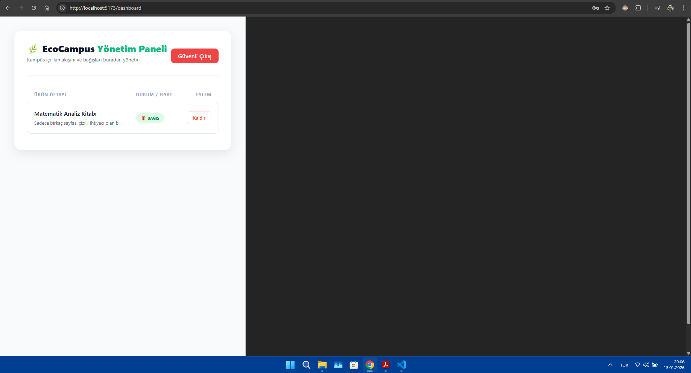
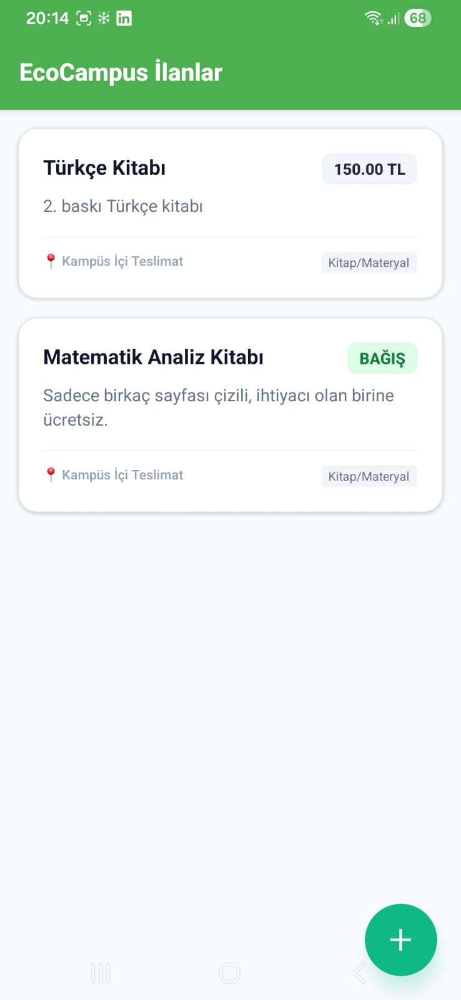
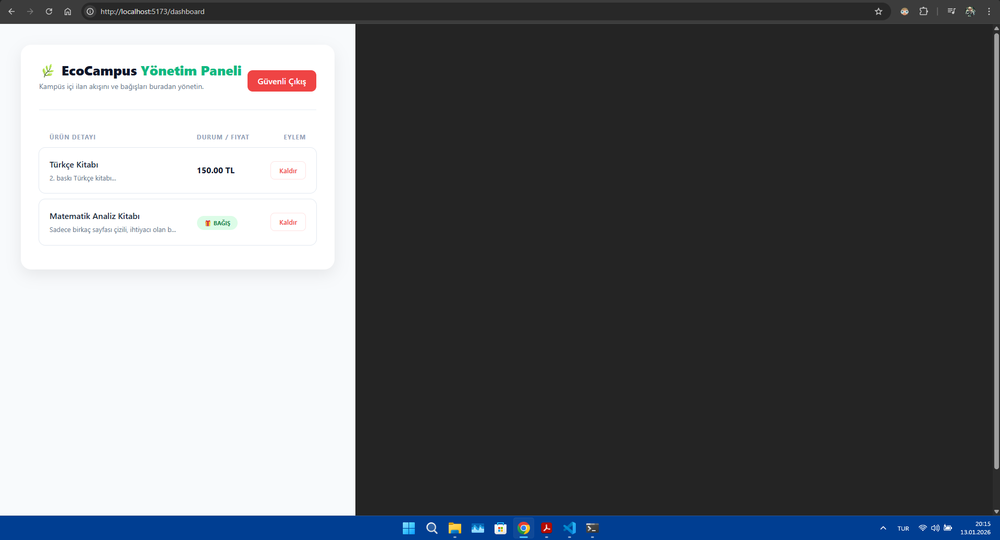

# EcoCampus: Full-Stack Web & Mobile Ecosystem

Bu proje, bir kampüs içi ilan ve bağış platformudur. **Full-Stack Web ve Mobil Uygulama Geliştirme** dersi kapsamında; veritabanı, sunucu tarafı, web yönetim paneli ve mobil kullanıcı arayüzü katmanlarının entegrasyonu ile geliştirilmiştir.

## Teknolojik Stack (MERN/PERN Benzeri)
- **Backend:** Node.js & Express REST API
- **Database:** PostgreSQL (İlişkisel Veri Modeli)
- **Web (Frontend):** React.js (Vite) - Yönetim Paneli
- **Mobile (Frontend):** React Native (Expo) - Kullanıcı Uygulaması
- **Middleware/Security:** JWT (Authentication) & Axios (API Management)

## Full-Stack Entegrasyonu
Proje, verinin tüm katmanlardaki yolculuğunu başarıyla yönetmektedir:
1. **Mobil Giriş:** Kullanıcı ürünü telefondan ekler (React Native -> Axios POST).
2. **Backend İşleme:** API isteği karşılar, doğrular ve veritabanına yazar (Node.js -> SQL).
3. **Database:** Veri ilişkisel olarak saklanır (PostgreSQL).
4. **Web Görüntüleme:** Eklenen veri anlık olarak web dashboard üzerinden silinebilir veya yönetilebilir (React -> Axios GET/DELETE).

## Kurulum Talimatları

### Backend
1. `cd backend`
2. `npm install`
3. `.env` dosyasını oluşturup veritabanı bilgilerini girin.
4. `node server.js`

### Web Panel
1. `cd frontend-web`
2. `npm install`
3. `npm run dev`

### Mobil Uygulama
1. `cd mobile`
2. `npm install`
3. `api/axiosConfig.js` içine güncel API linkini girin.
4. `npx expo start`

## Uygulama Ekran Görüntüleri

Projenin **Fullstack** çalışma döngüsünü (Mobil -> API -> Web) gösteren kanıtlar aşağıdadır:

| 📱 Mobil Uygulama Arayüzü | 🖥️ Web Yönetim Paneli (Genel) |
| :---: | :---: |
|  |  |

| Mobilden İlan Ekleme Anı | Web Panel Senkronizasyonu |
| :---: | :---: |
|  |  |

> **Teknik Not:** Görsellerde görüldüğü üzere, mobil uygulama üzerinden girilen veriler anlık olarak PostgreSQL veritabanına işlenmekte ve React Dashboard üzerinde asenkron olarak listelenmektedir.